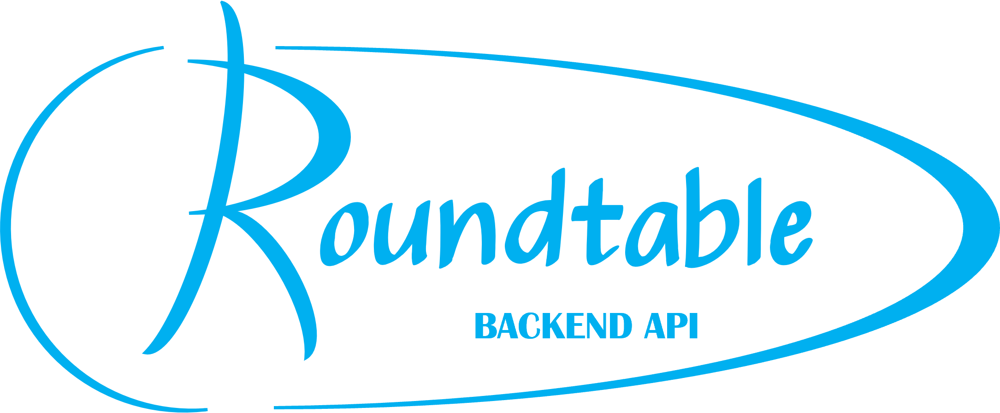

# 

The backend API for the Roundtable page.
- Railway link: https://roundtable-frontend-production.up.railway.app/
- GitHub repo: https://github.com/cswong235/roundtable-frontend

## Routes

1. GET / — serves the API's landing page.
2. GET /users — fetch all users.
3. POST /users — add a new user. Body: `name`, `rating` (1-5).
4. GET /categories — fetch all recipe categories.
5. GET /recipes — fetch all recipes, joined with their chef and category info.
6. GET /recipes/:id — fetch a single recipe by id, joined with its chef and category info.
7. POST /recipes — add a new recipe. Body: `user_id`, `category_id`, `title`, `ingredients`, `instructions`, and optionally `image`, `difficulty`, `time`.

## Other info
Built with:
- JavaScript
- Node
- Express
- PostgreSQL

## Links
- Railway link: https://roundtable-backend-production-9dfe.up.railway.app/
